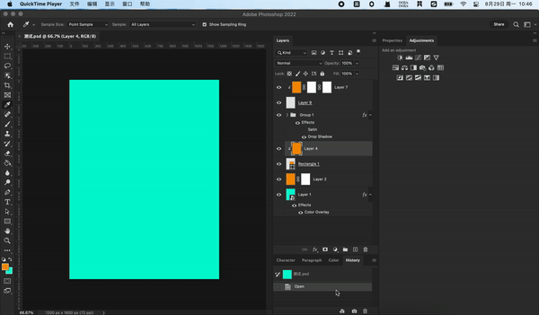

# cep-react-webpack-boilerplate

An awesome cep extension boilerplate with excellent development experience.



## Features

- modern frontEnd build tools: react + typescript + webpack
- complete typescript types for CSInterface/JSX/DescriptorInfo
- optimized eslint config helps you to avoid low level errors
- cross JSX/Browser message framework supports response callback
- cross JSX/Browser logging framework
- builtin command system
- builtin some useful shortcuts, eg: refresh by `cmd+r`
- builtin lots of useful utils, eg: promisifyFs.ts, psDomEvent.ts, layer.jsx, font.jsx
- JSX polyfill
- optimized VSCode settings, eg: .debug and manifest.xml syntax highlight
- distinct development/test/production mode both JSX and Browser for realistic commercial software develop

## Dev

Make sure you had enabled the [CEP debug mode](https://github.com/Adobe-CEP/Getting-Started-guides/blob/master/Client-side%20Debugging/readme.md#set-the-debug-mode).

### Clone boilerplate to CEP home level installation directory

```bash
# cd extensions directory
# MacOS
cd ~/Library/Application Support/Adobe/CEP/extensions
# Windows
cd ~/AppData/Roaming/Adobe/CEP/extensions

# clone the boilerplate
git clone git@github.com:tjx666/cep-react-webpack-boilerplate.git
```

### Install dependencies

```bash
pnpm install
```

### Start dev server

Using VSCode shortcut `cmd + shift + b` or run following command:

```bash
pnpm start
```

Then you can restart photoshop and open the extension.

## Build

```bash
# test version
pnpm run bundle:test

# production version, will bundle jsx -> jsxbin and minify the web code
pnpm run bundle
```
